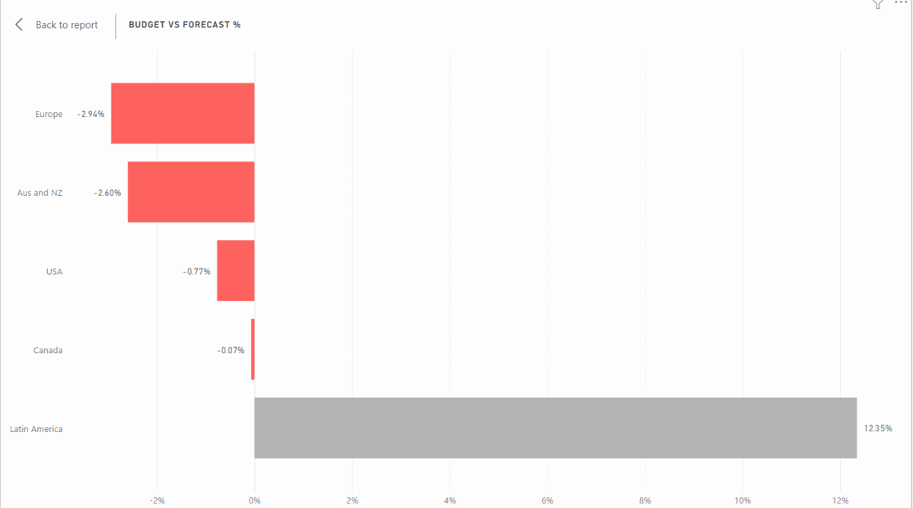

# IT Spendings Analysis

This is PowerBI analysis for spendings of IT department of a global company
The spendings of the department foucses on 3 specifications:
- Actual spendings which is the costs spended in real time.
- The budget the company has.
- Forcast spendings which is the predicted costs the company may spend.

 
The company provided dataset which conatians 12 months worth of budget ,forecast and 6 months of actual spendings in CSV files.

It also provided data of the cost element, country and it departments.

 
 

## Analysis Page one (Headline)

This page contains 9 charts and a slicer:
- Card shows last date of actuals and it changes when filter applied.
- slicer for regions.
- Gague chart shows actuals spendings vs budget.
- KPI shows budget compared to forecast by date.
- Line chart shows trending of actuals, budget and forecast by date.
- Area chart shows the running total of actuals, budget and forecast by date.
- Line and clustered column chart shows the difference between budget and forecast and its percentage by date.
- Clustered bar chart shows percentage of the difference between budget and forecast by region.
- Clustered bar chart shows percentage of the difference between budget and forecast by cost element group.
- Clustered bar chart shows percentage of the difference between budget and forecast by IT area.

  

 
 

## Analysis Page two (Regions)

This page contains 4 charts and 2 matrices:
- Clustered bar chart shows actuals and budget by region.
- Clustered bar chart shows percentage of the difference between budget and forecast by region.
- Filled map shows actuals bu country
- Scatter plot shows the difference between budget and forecast and its percentage by date with scatters sized by forcast by country
- Matrix shows the difference between budget and forecast for the intersections of IT area and regions.
- Matrix shows the difference between budget and forecast for the intersections of cost element group and regions.

  

 
 

## Analysis Page three (Decomposition)

This page contains decomposition tree shows the difference between budget and forecast with hierarchy of cost element group, cost element, country and it department.

  

 
 

  

